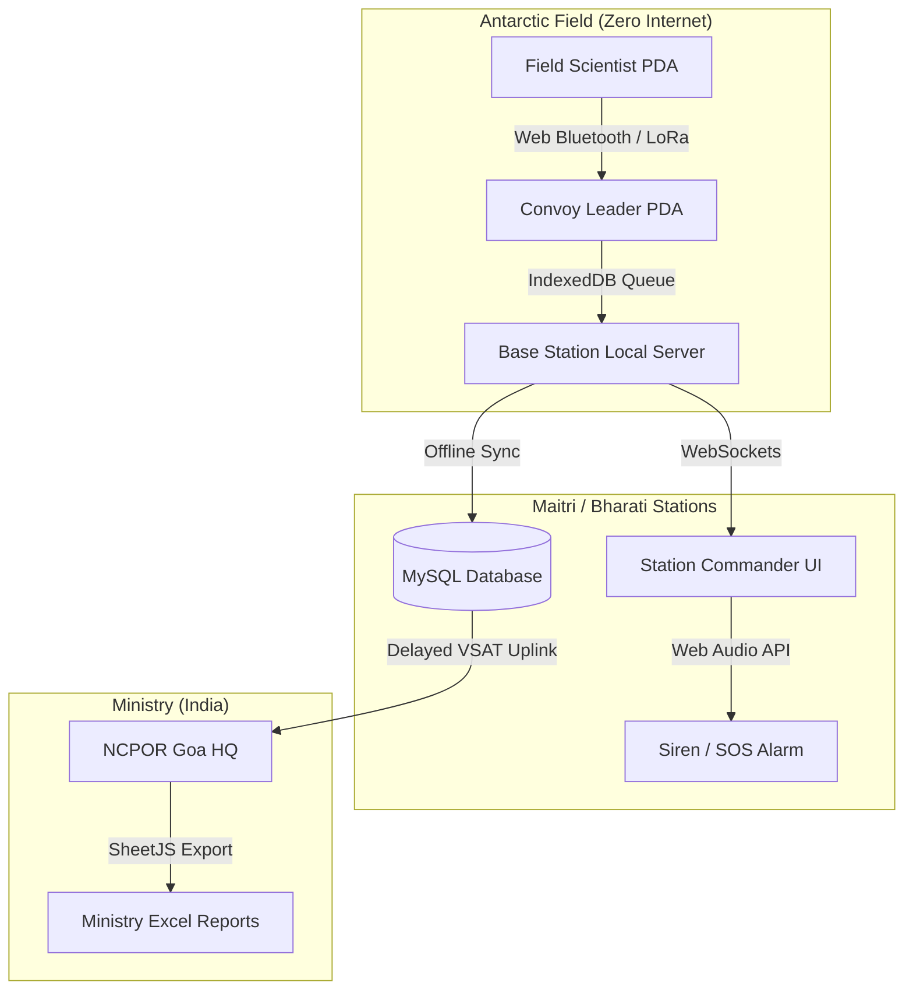
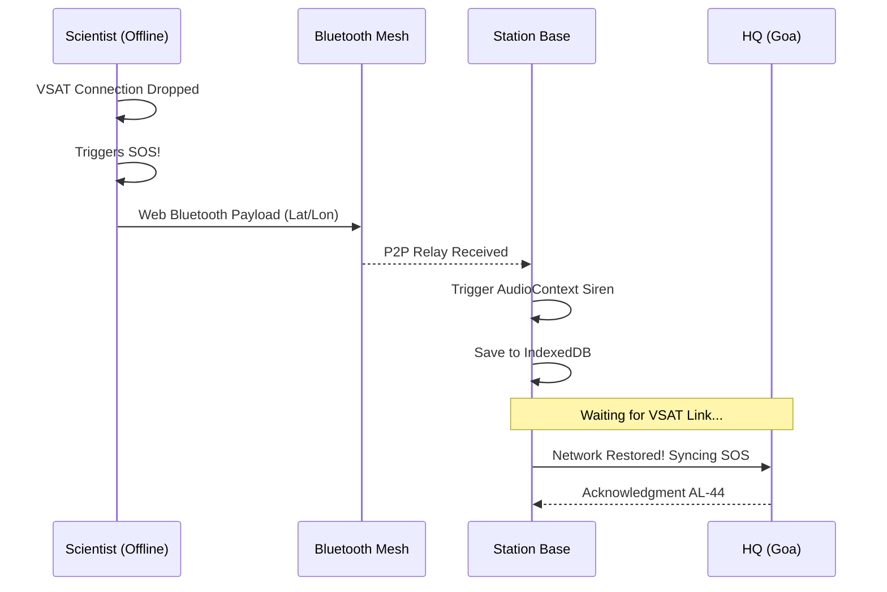

# 🏔️ POLARIS: Polar Operations, Logistics, and Resource Intelligence System
### Smart India Hackathon (SIH) 2024 - NCPOR & Ministry of Earth Sciences


POLARIS is an **Extreme Environment Logistics & Mission Control System** designed specifically for the Indian Antarctic Expeditions (Maitri & Bharati Stations). It replaces fragmented analog processes with a unified, real-time, offline-capable digital architecture.

---

## 🏗️ Technical Architecture

POLARIS is built to survive in extreme conditions (Zero-Internet, High-Latency VSAT, Blizzard blackouts). 



---

## 🔥 Key Modules & Features

### 1. 🛰️ Advanced Personnel Tracking (Live Radar)
- **ISRO-NRSC Geospatial Radar:** Dark-mode radar map visualizing 50km geofenced Safe Zones around Maitri and Bharati.
- **Auto-SOS (ETA Enforcement):** Scientists declare an Expected Time of Arrival (ETA). If breached (e.g., trapped in a crevasse), the system automatically triggers a high-priority distress signal to the Station Commander.
- **Blizzard Prediction:** Real-time weather widgets predicting Katabatic winds and triggering pre-emptive evacuation alerts.
- **Live Trajectories:** Interpolated path-tracking of PistenBully convoys across the Antarctic ice shelf.

### 2. 🚨 Global Offline P2P Mesh (SOS)
- **True Offline Capability:** Utilizes browser **IndexedDB** to locally queue distress signals when VSAT goes down.
- **P2P Bluetooth Mesh:** Integrates native `navigator.bluetooth.requestDevice()` to physically hunt for nearby field devices (simulating VHF/LoRaWAN P2P mesh) when internet is unavailable.
- **Web Audio Siren:** Hardware-level oscillator frequencies (AudioContext API) bypass standard browser autoplay policies to guarantee loud 800Hz distress sirens.

### 3. 📦 Cargo & Provenance Tracking
- **Optical QR Hardware Scanner:** HTML5 WebRTC camera integration to instantly scan cargo tags.
- **Supply Chain Timeline:** Displays the complete lifecycle of an asset (Manufactured in India ➔ Dispatched at Goa Port ➔ Transit in Cape Town ➔ Received at Bharati).
- **AL-1403 Manifest Generation:** Instantly builds cargo payloads for ice-core drilling equipment.

### 4. ❄️ Winter Inventory Guard (Burn Rate Logic)
- **Dynamic Burn Rate:** Calculates "Estimated Days Left" based on daily consumption metrics (e.g., 20,000 Liters of ATF Fuel burning at 200L/day).
- **Auto-Restock:** Store Managers simulate Vessel Arrivals (e.g., *MV Vasiliy Golovnin*), instantly hitting the backend to append millions of units to the ledger.
- **FIFO Enforcement:** Highlights expiring items (e.g., Medical Amoxicillin) in Red for immediate disposal.

---

## 🛠️ Technical Approach & Stack

### Frontend (Low-Bandwidth Optimized)
We deliberately chose **Vanilla JavaScript, HTML5, and CSS3** over bulky frameworks like React/Angular. This ensures the entire frontend payload is under `200KB`, critical for 128kbps VSAT connections.
- **Leaflet.js & CARTO:** For offline-capable dark mapping.
- **SheetJS:** Client-side generation of `.xlsx` reports for the Ministry to save server bandwidth.
- **HTML5 QR Code:** Native optical camera processing.

### Backend (Robust & Thread-Safe)
- **Java Spring Boot 3.2:** Enterprise-grade REST API.
- **Spring Security (JWT):** Stateless token-based auth for seamless session management across VSAT drops.
- **STOMP WebSockets:** Real-time bi-directional SOS broadcasting without HTTP polling overhead.
- **Hibernate / MySQL:** Relational mapping of complex logistical workflows.

---

## 🔄 Emergency Flowchart Logic



---

## 🚀 Setup Instructions

1. **Backend:**
   Navigate to `polaris-backend/` and run:
   ```bash
   mvn spring-boot:run
   ```
2. **Frontend:**
   Serve `polaris-frontend/` via any local HTTP server (e.g., VS Code Live Server) on port `5500`.

**Built with ❤️ for Indian Antarctic Expeditions.**
