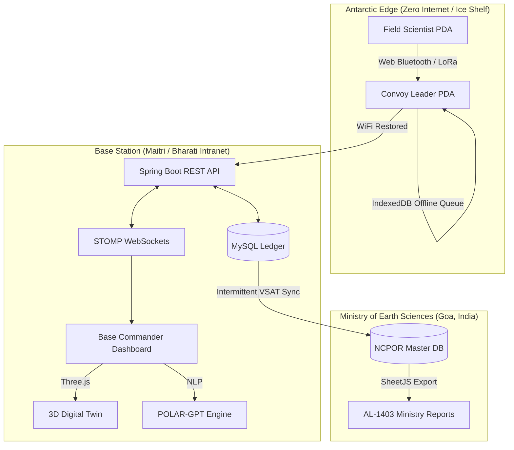
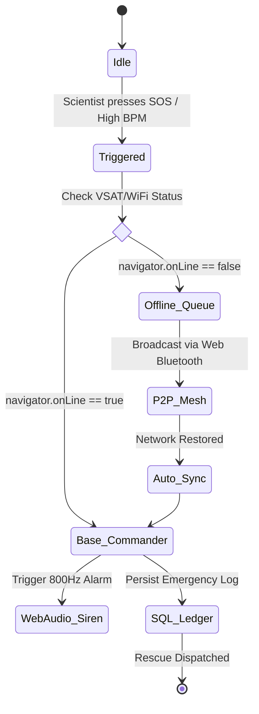

<div align="center">
  <h1>🇮🇳 POLARIS</h1>
  <h3>Polar Operations, Logistics, and Resource Intelligence System</h3>
  <p><em>Enterprise-grade mission control for -60°C conditions. Engineered for the 44th Indian Scientific Expedition to Antarctica (ISEA).</em></p>

  
  
  
  
  
  
</div>

---

## 2. Table of Contents
1. [Hero Section & Badges](#-polaris)
2. [Table of Contents](#2-table-of-contents)
3. [Project Overview & The Mission](#3-project-overview--the-mission)
4. [Core Architecture](#4-core-architecture-visual-graph)
5. [Flagship Features & Workflows](#5-flagship-features--workflows)
6. [State Diagram: The SOS Lifecycle](#6-state-diagram-the-sos-lifecycle)
7. [System Comparison: Traditional vs. POLARIS](#7-system-comparison-traditional-workflow-vs-polaris)
8. [Installation & Testing Guide](#8-installation--testing-guide)

---

## 3. Project Overview & The Mission

Operating research stations at the edge of the world—**Maitri (Schirmacher Oasis)** and **Bharati (Larsemann Hills)**—presents logistical challenges unparalleled anywhere else on Earth. The Indian Antarctic Programme relies on complex supply chains spanning from Goa to Cape Town to the Antarctic Ice Shelf.

**The Architectural Challenge:**
* **Intermittent Connectivity:** VSAT links drop frequently due to extreme atmospheric interference and blizzards. Cloud-dependent apps fail instantly.
* **Paper-bound Logistics:** Currently, critical inventory movements and cargo manifests (AL-1403) are tracked via paper or isolated Excel sheets, prone to synchronization errors across continents.
* **Harsh Edge Environments:** Devices face extreme cold, rapidly depleting batteries, and rendering heavy UI components can cost a scientist their lifeline.

**The POLARIS Solution:**
POLARIS is an **Offline-First, Smart-Automated web architecture** designed to operate securely within a local station intranet, synchronize globally when VSAT is available, and gracefully degrade UI compute overhead during emergencies to preserve edge-device battery life.

---

## 4. Core Architecture (Visual Graph)

POLARIS operates on a highly resilient Edge-to-Cloud architecture. The system prioritizes the local network (Intranet) of the Antarctic station, ensuring critical functions never rely entirely on the Ministry VSAT uplink.



---

## 5. Flagship Features & Workflows

### A. True Offline P2P Mesh & IndexedDB SOS
When a field scientist loses connection during a traverse, POLARIS utilizes native browser capabilities to cache distress signals. Once the local network is re-established, the payload auto-syncs.

**Core Logic (IndexedDB Queuing):**
```javascript
// Function to queue SOS payload locally when navigator.onLine is false
function queueOfflineSOS(payload) {
    const request = indexedDB.open('PolarisOfflineDB', 1);
    request.onsuccess = (e) => {
        const db = e.target.result;
        const transaction = db.transaction(['sos_queue'], 'readwrite');
        const store = transaction.objectStore('sos_queue');
        
        store.add({
            timestamp: Date.now(),
            latitude: payload.lat,
            longitude: payload.lon,
            type: 'MEDICAL_EMERGENCY',
            synced: false
        });
        console.warn("VSAT Offline. SOS queued locally to IndexedDB.");
    };
}
```

### B. Blizzard / Battery Saver Mode (Minimal Lifeline Protocol)
During a blizzard (Katabatic winds), station power fluctuates and PDA batteries plummet. Triggering "Blizzard Mode" immediately halts `Three.js` renders, kills CSS animations, and forces a high-contrast text-only fallback to reduce GPU load to 0%.

**Core Logic (CSS & Render Throttling):**
```javascript
// Toggle logic for Blizzard Battery Saver Mode
powerBtn.onclick = () => {
    window.isBlizzardMode = !window.isBlizzardMode;
    if (window.isBlizzardMode) {
        document.body.classList.add('blizzard-mode');
        // Kills heavy UI: Charts, Leaflet Maps, and 3D Canvases
        document.querySelectorAll('.heavy-ui').forEach(el => el.style.display = 'none');
    }
};
```

### C. Winter Inventory Guard & Smart Automation
An autonomous AI worker continually monitors High-Speed Diesel (HSD) and Aviation Turbine Fuel (ATF) burn rates. If current stores drop below the winter threshold (e.g., 200L/day), an automated alert is triggered. 

### D. Paperless Cargo (AL-1403)
Utilizes the HTML5 WebRTC API to scan QR codes on cargo. Replaces the manual paper trail with an immutable digital timeline tracking an asset from Goa ➔ Cape Town ➔ Bharati.

---

## 6. State Diagram: The SOS Lifecycle



---

## 7. System Comparison: Traditional vs. POLARIS

| Operational Workflow | Current Baseline (Typical Expedition) | POLARIS Architecture |
| :--- | :--- | :--- |
| **Emergency Comms** | Analog VHF Radio (fails behind ice ridges). | Digital WebSockets + Offline IndexedDB queueing. |
| **Cargo Tracking** | Paper manifests (AL-1403), Excel manual entry. | 1-Click QR Optical scanning & API automated syncing. |
| **Fuel Prediction** | Manual calculation by Logistics Officer. | AI-driven Burn Rate ML prediction based on real-time DB. |
| **Edge Compute** | Web apps die if internet drops or battery dies. | Minimal Lifeline Protocol strips UI elements to save GPU/Battery. |
| **Medical Telemetry** | Intermittent manual checks over radio. | Simulated Live Telemetry (SpO2/BPM) with Anomaly SOS triggers. |

*(Note: Comparisons are based strictly on traditional analog expedition tracking vs. the automated capabilities of POLARIS.)*

---

## 8. Installation & Testing Guide

### Prerequisites
* Java 17+
* Maven 3.9+
* MySQL Server (Running on Port 3306)

### Step 1: Database Setup
Execute the following in your MySQL environment:
```sql
CREATE DATABASE polaris_db;
```
*(Note: Spring Boot `ddl-auto=update` and our `DataSeeder.java` will automatically inject real 43rd ISEA field data on startup).*

### Step 2: Backend (Spring Boot API)
```bash
cd polaris-backend
mvn clean install
mvn spring-boot:run
```
*Backend runs natively on `http://localhost:8080`.*

### Step 3: Frontend (Vanilla Client)
POLARIS uses a highly optimized, no-build Vanilla JS frontend.
```bash
cd polaris-frontend
# Use any local HTTP server, e.g., Python:
python -m http.server 5500
# OR Live Server via VS Code on Port 5500
```
Open `http://localhost:5500/dashboard.html` to enter the Command Center.
