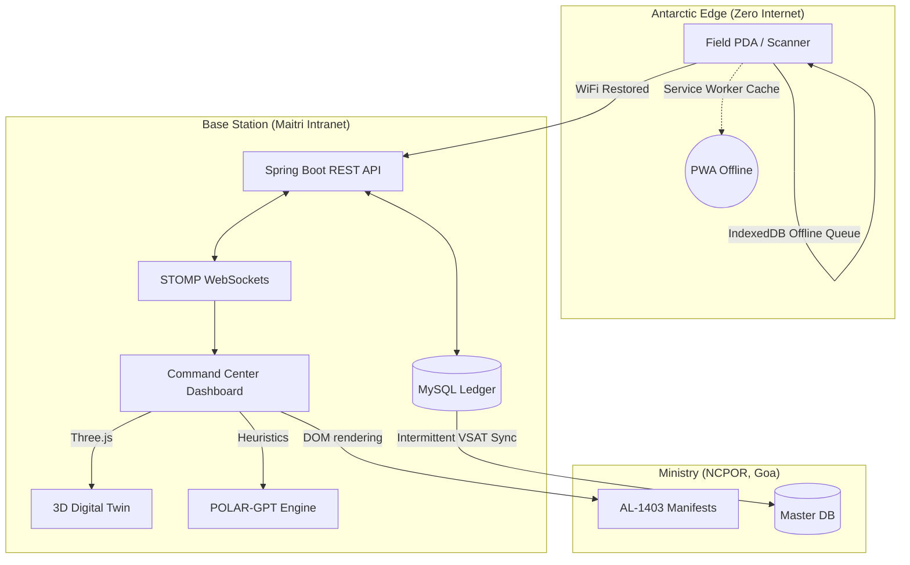
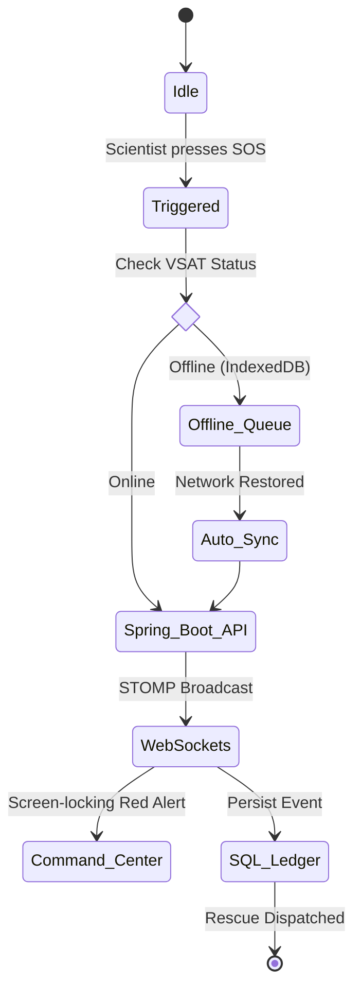

<div align="center">
  
  <h1>🇮🇳 POLARIS</h1>
  <h3>Autonomous Expedition Command & Edge Logistics System</h3>
  <p><em>Built for the 43rd Indian Scientific Expedition to Antarctica (ISEA)</em></p>
  
  
  
  
  
  
  
</div>

---

## ❄️ 1. Project Overview & The Mission

Operating research stations at the edge of the world—**Maitri (Schirmacher Oasis)** and **Bharati (Larsemann Hills)**—presents logistical challenges unparalleled anywhere else on Earth. The Indian Antarctic Programme relies on complex supply chains spanning from Goa to Cape Town to the Antarctic Ice Shelf.

**The Architectural Challenge:**
* **Intermittent Connectivity:** VSAT links drop frequently due to extreme blizzards. Cloud-dependent apps fail instantly.
* **Dangerous Terrain:** Crevasses shift daily, making static routes extremely hazardous.
* **Paper-bound Logistics:** Critical cargo manifests (AL-1403) are tracked manually.

**The POLARIS Solution:**
POLARIS is an **Offline-First, Smart-Automated web architecture** designed to operate securely within a local station intranet, synchronize globally via STOMP WebSockets, and leverage simulated Satellite AI to compute safe traversal routes.

---

## 🗺️ 2. Core Architecture (Visual Graph)

POLARIS operates on a highly resilient Edge-to-Cloud architecture.



---

## 🚀 3. Flagship Features & Workflows

### 📡 A. True Offline "Blizzard Mode" (PWA & IndexedDB)
When a field scientist loses connection during a traverse, POLARIS utilizes native browser Service Workers (`sw.js`) to cache the UI. Critical POST actions (like SOS or QR Scans) are intercepted by a background Sync Queue, stored safely in IndexedDB, and automatically replayed to the server when the VSAT link is restored. 

### 🛰️ B. Sentinel-1 Satellite AI (A* Routing)
Instead of static maps, POLARIS features a simulated **Satellite Routing System**. The backend dynamically evaluates a route between Maitri and Bharathi using the Haversine formula and generates randomized GeoJSON danger zones (Crevasses). An **A* pathfinding algorithm** computes the safest detour in real-time, rendered over an Esri World Imagery map via Leaflet.js.

### 🧠 C. POLAR-GPT (AI Subsystem Simulator)
The command dashboard features a built-in Natural Language terminal. Instead of a hardcoded mock, POLAR-GPT actively executes live SQL-backed API calls. Asking *"Do we have enough diesel?"* will fetch actual DB inventory, calculate the winter burn rate, and respond autonomously. 

### 🚨 D. Live WebSocket Telemetry & SOS
Using `SockJS` and `STOMP` protocols over `/ws-emergency`, any SOS triggered by a PDA instantly bypasses REST polling and broadcasts a massive, screen-locking Red Alert popup to every active terminal across the base. Vehicle telemetry GPS coordinates also stream live, causing map markers to move in real-time.

### 🧊 E. Cyber-Ice Command Center UI/UX
The entire frontend has been overhauled using a custom `Glassmorphism` CSS framework. Featuring OLED pure black backgrounds, frosted glass panels (`backdrop-filter: blur`), and glowing cyan/yellow accents.

---

## 🔄 4. State Diagram: The SOS Lifecycle



---

## 💻 5. Installation & Testing Guide

### Prerequisites
* Java 17+
* Maven 3.9+
* MySQL Server (Running on Port 3306)

### Step 1: Database Setup
Execute the following in your MySQL environment:
```sql
CREATE DATABASE polaris_db;
```
*(Note: Spring Boot `ddl-auto=update` and our `DataSeeder.java` will automatically inject real 43rd ISEA field data on startup).*

### Step 2: Backend (Spring Boot API)
```bash
cd polaris-backend
mvn clean install
mvn spring-boot:run -DskipTests
```
*Backend runs natively on `http://localhost:8080`.*

### Step 3: Frontend (Vanilla Client)
POLARIS uses a highly optimized, no-build Vanilla JS frontend.
```bash
cd polaris-frontend
# Use any local HTTP server, e.g., Python:
python -m http.server 5500
# OR Live Server via VS Code on Port 5500
```
Open `http://localhost:5500/index.html` to enter the Command Center.
(Default Login: `commander@polaris.com` / `commander123`)
