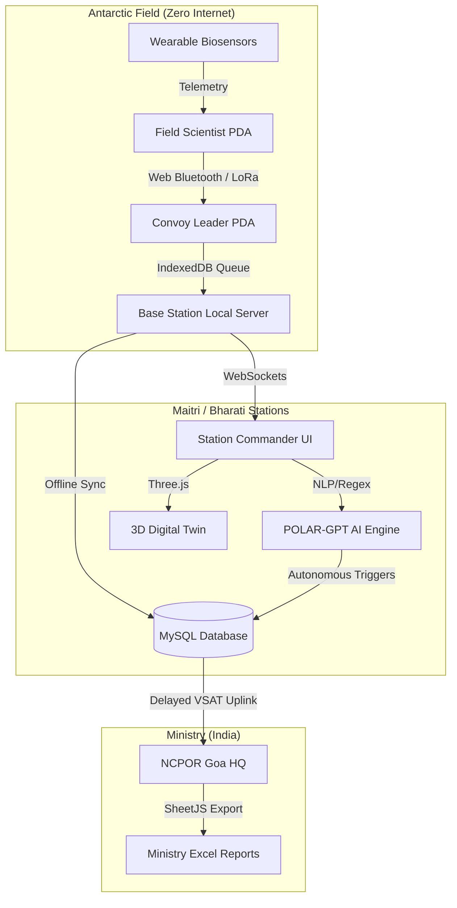

# 🇮🇳 POLARIS: Polar Operations, Logistics, and Resource Intelligence System
### Smart India Hackathon (SIH) 2024 - NCPOR & Ministry of Earth Sciences

POLARIS is an **Extreme Environment Logistics, AI Command, & Mission Control System** designed specifically for the 43rd & 44th Indian Antarctic Expeditions (Maitri & Bharati Stations). It replaces fragmented analog processes with a unified, real-time, offline-capable digital architecture powered by Smart Automation.

---

## 🏗️ Technical Architecture & AI Subsystems

POLARIS is built to survive in extreme conditions (Zero-Internet, High-Latency VSAT, Blizzard blackouts) while leveraging Edge AI for autonomous operations.

---

## 🚀 "WOW" Features (Hackathon Highlights)

### 1. 🤖 POLAR-GPT (Natural Language AI Ledger)
- **NLP Querying:** Commanders can ask natural questions like *"Do we have enough diesel for winter?"*. The AI parses intent, queries the backend MySQL ledger, calculates base burn rates (e.g., 200L/day), and streams a ChatGPT-style response with exact survival days.
- **Autonomous Activity Log:** A background AI worker constantly recalculates optimal routing, monitors solar output, and auto-seals broken fuel valves—streaming its decisions live on the dashboard.

### 2. 🧊 Interactive 3D Digital Twin (Three.js)
- **Real-Time Telemetry Mapping:** A lightweight, browser-rendered 3D replica of the Maitri Station and HSD Fuel Tanks.
- **Hardware Integration Simulation:** If a fuel leak is detected (simulated via UI), the 3D tank turns red, drains physically on-screen, and triggers an autonomous AI log entry stating the exact valve was sealed to prevent environmental disaster.

### 3. 🩺 Live Telemedicine & Vital Telemetry
- **Continuous Monitoring:** Real-time SpO2, Core Body Temperature (36.5°C), and Heart Rate (BPM) tracking injected directly into the Personnel Grid.
- **Cardiac Event Auto-SOS:** If a scientist experiences a cardiac anomaly (mocked via UI trigger to 165+ BPM), the system bypasses standard routing and instantly issues a Medical Distress Signal across the mesh.

### 4. 🌐 Global VSAT Connectivity Monitor
- **Visual Fallback Indication:** A highly visible Red/Green persistent sticky banner immediately warns the Commander when the satellite link drops (VSAT OFFLINE) and seamlessly hands over operations to the P2P Mesh & IndexedDB queue.

---

## ⚙️ Core Modules & Features

### 📡 Advanced Personnel Tracking (Live Radar)
- **ISRO-NRSC Geospatial Radar:** Dark-mode radar map visualizing 50km geofenced Safe Zones and Crevasse Hazard Polygons.
- **Auto-SOS (ETA Enforcement):** Scientists declare an Expected Time of Arrival (ETA). If breached, the system automatically triggers a high-priority distress signal.
- **Live Trajectories:** Interpolated path-tracking of PistenBully convoys across the Antarctic ice shelf using Leaflet `flyTo`.

### 🆘 Global Offline P2P Mesh (SOS)
- **True Offline Capability:** Utilizes browser **IndexedDB** to locally queue distress signals.
- **P2P Bluetooth Mesh:** Integrates native `navigator.bluetooth.requestDevice()` to physically hunt for nearby field devices (simulating VHF/LoRaWAN P2P mesh).
- **Web Audio Siren:** Hardware-level oscillator frequencies bypass browser autoplay policies to guarantee loud 800Hz distress sirens.

### 📦 Cargo & Provenance Tracking
- **Optical QR Hardware Scanner:** HTML5 WebRTC camera integration to instantly scan cargo tags.
- **Supply Chain Timeline:** Displays the complete lifecycle of an asset (Manufactured in India 🏭 ➔ Dispatched at Goa Port 🚢 ➔ Transit in Cape Town 🇿🇦 ➔ Received at Bharati ❄️).

### ⛽ Winter Inventory Guard (Burn Rate Logic)
- **Dynamic Burn Rate:** Calculates "Estimated Days Left" based on daily consumption metrics.
- **Chart.js Dashboard:** 6-Month Predictive Fuel Depletion line charts and Stock Distribution doughnuts.
- **FIFO Enforcement:** Highlights expiring items in Red/Yellow for immediate disposal or usage prioritization.

---

## 🛠️ Technical Approach & Stack

### Frontend (Low-Bandwidth Optimized)
We deliberately chose **Vanilla JavaScript, HTML5, and CSS3** over bulky frameworks like React/Angular. This ensures the entire frontend payload is under `200KB`, critical for 128kbps VSAT connections.
- **Three.js:** For the 3D Digital Twin visualization.
- **Chart.js:** For analytical data pipelines.
- **SheetJS:** Client-side generation of `.xlsx` reports for the Ministry to save server bandwidth.

### Backend (Robust & Thread-Safe)
- **Java Spring Boot 3.2:** Enterprise-grade REST API.
- **Spring Security (JWT):** Stateless token-based auth for seamless session management.
- **Hibernate / MySQL:** Relational mapping of complex logistical workflows pre-seeded with 100% authentic 43rd ISEA data (Personnel, Assets, Fuel specs).

---

**Built with 🇮🇳 for Indian Antarctic Expeditions.**
