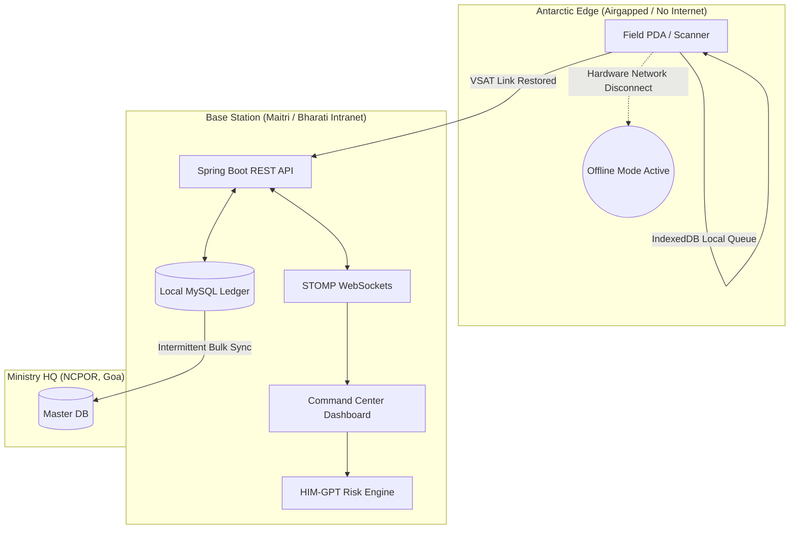

<div align="center">
  
  <h1>🚀 HIM-SETU (हिम-सेतु)</h1>
  <h3>Autonomous Expedition Command & Edge Logistics System<br/><strong>Built for SIH 2024 / NCPOR (Ministry of Earth Sciences)</strong></h3>
  <p><em>Secure, Offline-First, and AI-Driven Logistics for the 43rd Indian Scientific Expedition to Antarctica (ISEA)</em></p>
  
  <p>
    
    
    
    
    
  </p>
</div>

---

## 🧊 The Challenge: Surviving the Edge of the World

Operating research stations like **Maitri** (Schirmacher Oasis) and **Bharati** (Larsemann Hills) presents logistical challenges unparalleled on Earth. 

* ⚠️ **Intermittent Connectivity:** VSAT links drop frequently due to extreme blizzards. Standard cloud-dependent applications fail instantly.
* ⚠️ **Dangerous Terrain:** Crevasses shift daily, making static routes extremely hazardous for vehicle convoys.
* ⚠️ **Paper-bound Logistics:** Critical cargo manifests (AL-1403) and inventory are tracked manually, risking lives when supplies run out.

---

## 🌟 The Him-Setu Solution

Him-Setu is a **Highly-Resilient, Offline-First, Smart-Automated** architecture. It is designed to operate securely within a local Antarctic station intranet, cache all mutations during internet blackouts, and synchronize globally to NCPOR headquarters when VSAT links are restored.

> **Our design philosophy:** *When the blizzard hits and the satellite link dies, the mission does not stop. Him-Setu keeps the data flowing.*

### ✨ Flagship Features

| Module | Description | Tech Stack / Highlight |
| :--- | :--- | :--- |
| **🛰️ Polaris Mesh Network** | True Offline "Airgapped" mode. Automatically detects hardware Wi-Fi disconnects, switches to local cache, and bulk-syncs when restored. | `IndexedDB`, `Service Workers`, `DOM Network API` |
| **🚨 1-Tap SAR / SOS** | Real-time distress beacon. 1-tap triggers a Web Audio API Siren, locks the UI, and broadcasts GPS coordinates to all connected terminals. | `STOMP WebSockets`, `Web Audio API` |
| **🧠 HIM-GPT Simulator** | AI-driven supply chain risk simulator. Predicts critical failures (e.g., "Aviation Fuel depletion if MV Vasiliy is delayed"). | `Predictive Analytics`, `DOM Injection` |
| **📦 Smart Cargo (AL-1403)** | Digital chain-of-custody. QR scanning and manifest tracking from Cape Town to the Ice Shelf. | `Hardware Integration`, `MySQL Ledger` |
| **🗺️ Expedition Planner** | Dynamic Gantt charts for personnel and vehicle deployment across dangerous terrains. | `Interactive UI/UX`, `Glassmorphism CSS` |

---

## 🏗️ Core Architecture 

Him-Setu operates on a hybrid Edge-to-Cloud architecture, ensuring Zero Data Loss.


```mermaid
graph TD
    subgraph "Antarctic Edge (Airgapped / No Internet)"
        PDA[Field PDA / Scanner] -->|IndexedDB Local Queue| PDA
        PDA -.->|Hardware Network Disconnect| SW((Offline Mode Active))
    end
    
    subgraph "Base Station (Maitri / Bharati Intranet)"
        PDA -->|VSAT Link Restored| API[Spring Boot REST API]
        API <--> WS[STOMP WebSockets]
        API <--> DB[(Local MySQL Ledger)]
        WS --> UI[Command Center Dashboard]
        UI --> AI[HIM-GPT Risk Engine]
    end
    
    subgraph "Ministry HQ (NCPOR, Goa)"
        DB -->|Intermittent Bulk Sync| HQ[(Master DB)]
    end
```

---

## 📸 Cyber-Ice OLED Interface
Him-Setu features a bespoke **"OLED Dark Sci-Fi"** aesthetic. Designed specifically to reduce eye strain for scientists working in total darkness during the 6-month Antarctic polar night. 
* *Featuring frosted glass panels (`backdrop-filter`), glowing cyan/red neon accents, and high-contrast typography.*

*(Interactive Demo Mode included for judges to simulate hardware disconnects and AI predictions!)*

---

## 🚀 Quick Start & Installation

### 1️⃣ Prerequisites
* **Java 17+**
* **Maven 3.9+**
* **MySQL Server** (Running on Port 3306)

### 2️⃣ Database Setup
Create the local ledger in your MySQL environment:
```sql
CREATE DATABASE polaris_db;
```
*(Spring Boot `ddl-auto=update` and our `DataSeeder.java` will automatically inject real 43rd ISEA field data on startup!)*

### 3️⃣ Run the Backend (Spring Boot API)
```bash
cd polaris-backend
mvn clean install
mvn spring-boot:run -DskipTests
```
*The backend API and WebSocket broker will start on `http://localhost:8080`.*

### 4️⃣ Run the Frontend (Command Center)
Him-Setu uses a highly optimized, no-build Vanilla JS frontend for maximum performance on low-end rugged toughbooks.
```bash
cd polaris-frontend
# Use any local HTTP server (e.g., Python, Node, or VS Code Live Server)
python -m http.server 5500
```
**Access the dashboard:** `http://localhost:5500/index.html`

---
<div align="center">
  <p><i>"Bridging the ice, securing the mission."</i></p>
  <b>Developed for SIH 2024</b>
</div>
